# RealEstateManagement

Kho chứa mã chính thức của dự án Quản lý thông tin bất động sản trên nền tảng Amazon Web Services

1. Quy định và quy trình về việc sử dụng git và github đối với kho mã

Về tổng quan chúng ta sẽ không trực tiếp code hoặc đẩy commit lên nhánh master thay vào đó tạo ra nhánh develop và từ nhánh này phát triển những tính năng(tạo các nhánh tính năng) hoặc sửa lỗi,... sau đó thì gộp lại vào nhánh develop, từ nhánh develop chúng ta sẽ đổ qua nhánh release nếu cần release, nếu nhánh release có lỗi thì đổ ngược lại code về develop để fix, nếu ổn thì từ release đẩy code qua production, nếu production có lỗi thì tạo nhánh hotfix, hotfix đổ code về develop và lặp lại.

Phần issue có thể dùng để giao việc, đặt câu hỏi

Ví dụ: A giao việc cho B, thì viết nội dung và gán cho B( sử dụng assignees) và dùng label là feature

Ta có ví dụ sau: Wangzhatt24 giao việc cho chính mình rằng hãy tạo một card.model.js
Khi thao tác giao việc bằng issues xong thì tiêu đề issues trong github có dạng như sau: 

   wangzhatt24 - create-card.model.js file #1

có thể hiểu là Ai làm? Làm gì? #1 là số để tham chiếu, hãy để ý điều này

Chúng ta sẽ tạo một branch trong git để giải quyết issue này: 

    git checkout -b feature/1-add-card-model.js develop

Có nghĩa là từ nhánh develop checkout ra một nhánh để giải quyết tính năng yêu cầu

Chú ý cái #1 mình sẽ tạo tương tự trong git là 

    label/#số tham chiếu-nội dung yêu cầu

Sau đó chúng ta sẽ làm việc được giao, sau đó git status và git add để theo dõi như thường

Nhưng phần commit thì hãy như sau: 

    git commit -m "#1 - ai làm - làm gì?"

Có thể thấy #1 để tham chiếu tới issues cụ thể, điều này là quan trọng, kiểm tra phần issues đều có tham chiếu và thông tin đầy đủ về người làm, issues nào.

Nhớ là git push origin tên nhánh để đẩy lên github nhé

Sau đó chúng ta lên github để tạo một pull request để gộp nhánh mà chúng ta đang phát triển(fearture #1) vào nhánh develop, nhớ ghi trong pull request phải có #1 để tham chiếu tới nó nhé

Tạo pull xong thì người quản lý có thể gán người review code, gán labels,...

Người có trách nhiệm merge sẽ merge và để lại comment

Giờ dưới local bạn sẽ checkout qua nhánh develop và pull code từ remote về git pull origin develop

Sau đó chúng ta có thể muốn release, ta sẽ tạo một nhánh release từ nhánh develop

    git checkout -b release-1.1.0 develop
    git tag "v1.1.0"
    git push --tags

Kiểm tra trên github sẽ có tags

Sau đó git merge develop để gộp code nhánh develop qua

Sau đó git push origin release-1.1.0 để đẩy code lên

Từ release chúng ta sẽ tạo pull request vào nhánh master( hoặc main) 

Sau khi gộp code xong, chúng ta ở local master( hoặc main) pull về: 

    git pull origin master

Tóm tắt lại những gì đã đi qua: 

 - Từ nhánh develop tạo fearture #1-create-card-model
 -  Gộp lại vào develop
 - Từ develop tạo release
 - Pull code develop qua release
 - Từ release pull qua master

Bây giờ ta sẽ xóa nhánh release và nhánh fearture ở local và remote

    remote: git push origin -d release-1.1.0
    local: git branch -d release-1.1.0 
    remote: git push origin -d fearture/1-create-card-model.js 
    local: git branch -d fearture/1-create-card-model.js 

Nếu có lỗi ở production chúng ta sẽ hot fix bằng cách tạo nhánh hotfix rồi đổ về nhánh develop hoặc fix ở đó rồi pull request qua master luôn

    git checkout -b hotfix
    git add, git commit -m "#4 - fix some"
    git push origin hotfix
    Tạo pull request vào master
    Sau đó checkout master và pull từ remote về
    Sau đó xóa các branch đã xong

2. Configuration

Đầu tiên câu hỏi đặt ra là cấu hình ứng dụng chạy trên cổng nào, môi trường là gì, nếu cấu hình thêm database, aws s3,... thì nên cấu hình như thế nào?
NestJs đề xuất [cách cấu hình](https://docs.nestjs.com/techniques/configuration)
Thế nhưng nó quá khá phức tạp và không đáp ứng được các nhu cầu cơ bản trên
Ví dụ: 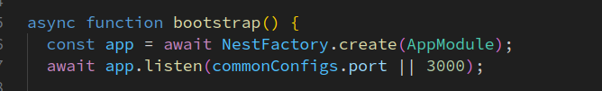
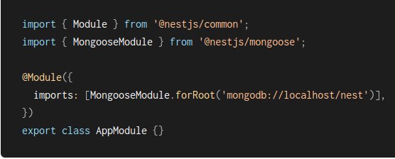

Nên tôi quyết định sử dụng cách cũ và dễ dàng tiếp cận hơn:
[Đọc thêm](https://medium.com/@datails/nestjs-keep-it-simple-stupid-4101d8bdf59c)
Tôi tạo một thư mục và file như sau: configs/configs.ts
Trong đó dùng dotenv để đọc file cấu hình đơn giản như sau:

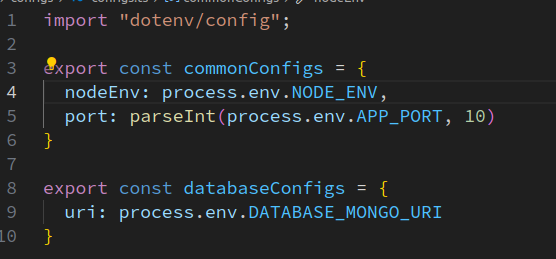

Sau đó cấu hình cơ bản Swagger

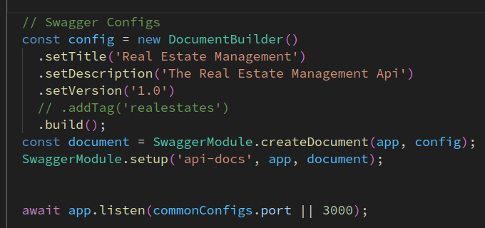

3. Tổng quan tài liệu:

Vì chúng ta sử dụng swagger nên những mô tả về yêu cầu đầu ra đầu vào cũng khá đầy đủ, tôi chỉ viết những phần sử dụng mà tôi nghĩ là sẽ mơ hồ nếu thiếu

Cách chạy api:
**Phải có file env( Liên hệ backend để lấy file mẫu)**

Đảm bảo terminal ở trong thư mục api

Sau đó cài đặt phụ thuộc bằng

    npm install
 
 Khi đã cài đặt các phụ thuộc ta chạy lệnh sau:

    npm run start:debug
   
  Hoặc:  

    npm run start:dev

Sau đó nhìn vào màn hình console sẽ trả về đường link để truy cập đến trang tài liệu api( swagger)

Account Management

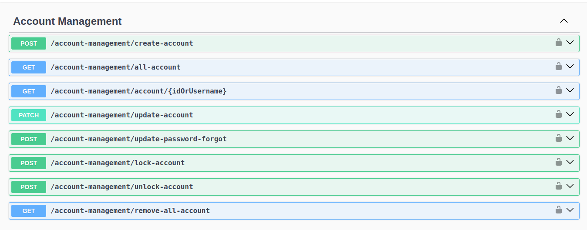

Authentication

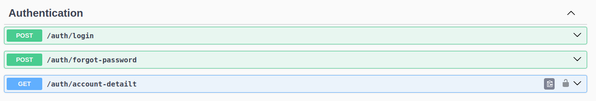

Với api này thì chúng ta sẽ dùng đăng nhập trước, điền tài khoản mật khẩu và chạy thì nếu đúng hệ thống sẽ trả về cho chúng ta một access_token, copy và dán token này vào cái biểu tượng ổ khóa tức là đã đăng nhập.

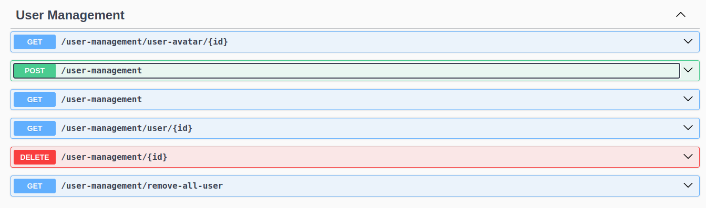

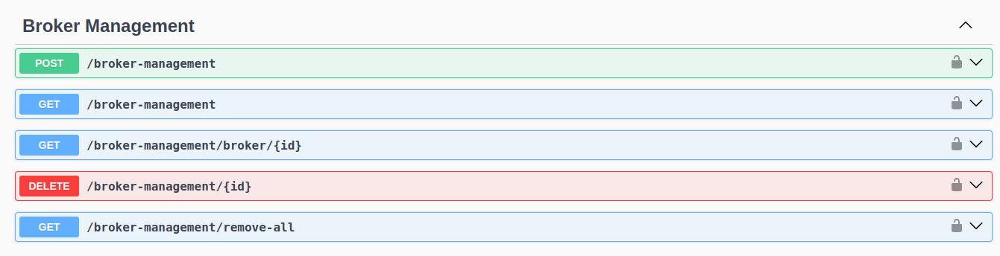

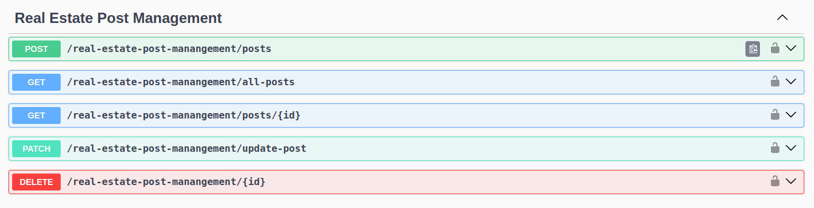

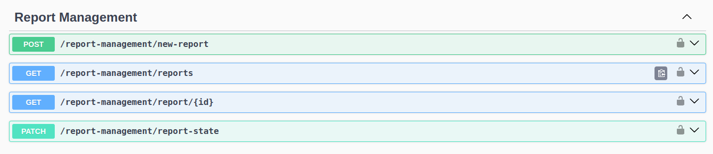

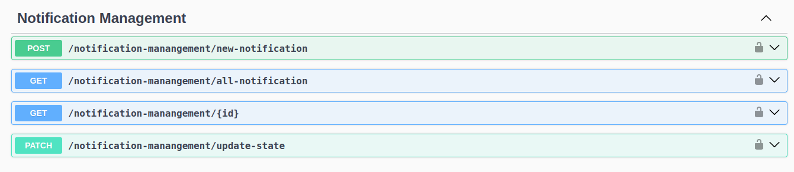